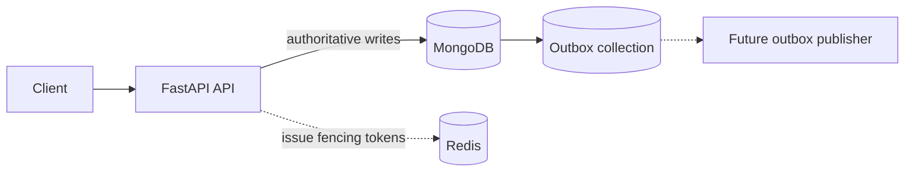

# Payment Reservation Service

A production-shaped FastAPI service for creating and transitioning payment reservations safely under retries and concurrency. It demonstrates MongoDB as the source of truth, idempotency keys, optimistic concurrency, Redis fencing tokens, an outbox contract, Docker Compose, and automated CI.

> **Scope:** This is an educational portfolio project. It records payment reservations; it does not connect to a bank or payment provider and does not handle raw card data.

## Quick path

### Run the full stack

Requirements: Docker Desktop with Compose v2.

```bash
docker compose up --build
```

Verify the API:

```bash
curl http://localhost:8000/health
```

Expected response:

```json
{"status":"ok","service":"payment-reservation-service","environment":"development"}
```

Stop the stack:

```bash
docker compose down
```

### Run tests without Docker

Requirements: Python 3.11, 3.12, or 3.13.

```bash
python -m pip install -e ".[dev]"
python -m pytest
```

The tests use in-memory fakes, so MongoDB and Redis are not required for the test suite.

## Architecture



### Source-of-truth rules

| Concern | Authority | Reason |
|---|---|---|
| Reservation state | MongoDB | Redis locks must not decide durable state |
| Idempotency | MongoDB unique key + request fingerprint | Retries must replay, not duplicate work |
| State transitions | MongoDB conditional update | Prevents check-then-act races |
| Fencing tokens | Redis `INCR`, enforced by MongoDB | Rejects stale or zombie workers |
| Events | Outbox collection contract | Makes delivery retryable and deduplicated |

Redis is an allocator for fencing tokens, not the final consistency boundary. The HTTP routes currently do not require a fencing token, and a background outbox publisher is intentionally not included yet.

## API contract

Base URL: `http://localhost:8000`

### Create a reservation

`POST /reservations`

Required header:

```http
Idempotency-Key: checkout-123
```

Request body:

```json
{
  "payment_reference": "payment-123",
  "amount": "10.50",
  "currency": "USD",
  "expires_in_seconds": 300
}
```

Money is represented as a decimal string. Do not send floating-point money values.

| Situation | Status | Behavior |
|---|---:|---|
| New request | `201 Created` | Stores one reservation and returns `Location` |
| Same key and same payload | `200 OK` | Replays the original reservation |
| Same key and different payload | `409 Conflict` | Rejects the key reuse |
| Missing idempotency key | `400 Bad Request` | Explains the required header |
| Persistence unavailable | `503 Service Unavailable` | Fails explicitly; no fake durability |

Example:

```bash
curl -i -X POST http://localhost:8000/reservations \
  -H "Content-Type: application/json" \
  -H "Idempotency-Key: checkout-123" \
  -d '{"payment_reference":"payment-123","amount":"10.50","currency":"USD","expires_in_seconds":300}'
```

### Read and transition a reservation

```text
GET  /reservations/{reservation_id}
POST /reservations/{reservation_id}/confirm
POST /reservations/{reservation_id}/cancel
```

Only a pending, non-expired reservation can transition. Each transition increments `version` and uses a conditional MongoDB update over the current state, expiry, and version.

Conflict responses use `application/problem+json` and distinguish expired reservations from invalid terminal states.

## Persistence model

The `reservations` collection stores:

```json
{
  "_id": "reservation-uuid",
  "payment_reference": "payment-123",
  "amount": "10.50",
  "currency": "USD",
  "status": "pending",
  "expires_at": "UTC datetime",
  "version": 0,
  "idempotency_key": "checkout-123",
  "request_fingerprint": "sha256 digest",
  "last_fencing_token": 0
}
```

Indexes created by the repository:

- unique `idempotency_key` index for replay safety;
- `expires_at` index for expiry sweeps;
- unique `event_id` plus delivery-order indexes for the outbox collection.

MongoDB timestamps are decoded with timezone awareness. Reservation expiration is always enforced in application predicates; a future TTL cleanup job must not be treated as the mechanism that prevents expired confirmation.

## Concurrency patterns demonstrated

### Idempotency

The first request stores a fingerprint of the request body. A retry with the same key and fingerprint receives the original result. A retry with a different fingerprint receives `409 Conflict`.

### Optimistic transition

The transition filter includes the expected status, expiry, and version. If another worker wins the race, the stale update matches zero documents and cannot overwrite the newer state.

### Fencing tokens

`RedisFencingTokenProvider` uses `INCR` on a namespaced resource key. MongoDB accepts a token only when it is greater than `last_fencing_token`, preventing a worker that resumed after a lock expiry from performing a zombie write.

### Outbox

`outbox.py` defines a typed event and an idempotent repository contract. The MongoDB index makes `event_id` unique. A publisher, retry policy, and delivery metrics are deliberately left as the next extension rather than being implied by the current API.

## Repository layout

```text
src/payment_reservation_service/
├── api.py           # HTTP routes and Problem Details responses
├── concurrency.py   # Redis and in-memory fencing-token providers
├── config.py        # Environment-based settings
├── domain.py        # Immutable reservation models and states
├── main.py          # FastAPI application wiring
├── mongo.py         # MongoDB repository and index setup
├── outbox.py        # Event contract and idempotent fake
├── repository.py    # Storage protocol and test fake
└── schemas.py       # Decimal-safe API schemas

tests/
├── test_health.py
├── test_reservations.py
└── test_concurrency_outbox.py
```

## Configuration

The API starts without MongoDB configuration so `/health` can run locally. Reservation routes return `503` until persistence is configured.

| Variable | Default | Purpose |
|---|---|---|
| `APP_NAME` | `payment-reservation-service` | Service name |
| `APP_ENV` | `development` | Runtime environment label |
| `LOG_LEVEL` | `INFO` | Reserved logging setting |
| `MONGODB_URI` | unset | MongoDB connection URI |
| `MONGODB_DATABASE` | `payment_reservations` | Database name |

Docker Compose supplies the MongoDB URI for the API container and starts MongoDB and Redis with health checks.

## CI and verification

GitHub Actions runs the test suite on Python 3.11, 3.12, and 3.13. The local verification path is:

```bash
python -m pytest
python -m compileall -q src tests
docker compose config
docker compose build api
```

## Intentional non-goals

- No raw PAN, CVV, or card data.
- No authentication or merchant tenant scoping yet.
- No real payment-provider authorization or capture.
- No background outbox publisher.
- No production deployment manifests.

These boundaries keep the concurrency and persistence contracts reviewable. They are also the next areas to extend if this becomes a larger portfolio project.

## Next improvements

1. Add a readiness endpoint that checks MongoDB and Redis separately from liveness.
2. Add a real transactional outbox write and a retrying publisher.
3. Add authenticated merchant scoping to every reservation query and idempotency key.
4. Add MongoDB/Redis integration tests in CI.
5. Add structured logs, metrics, and trace IDs.
